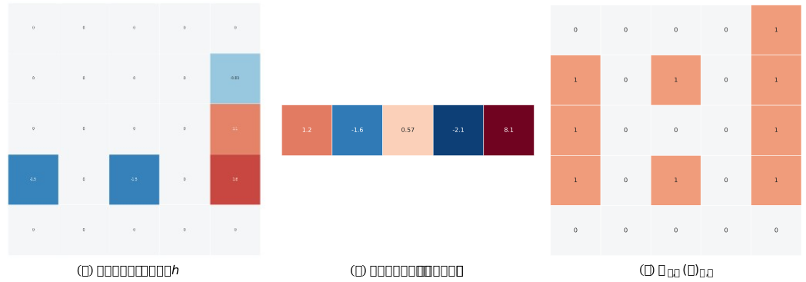
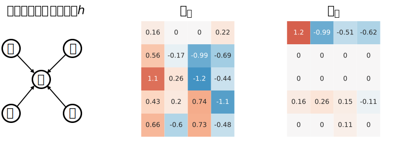
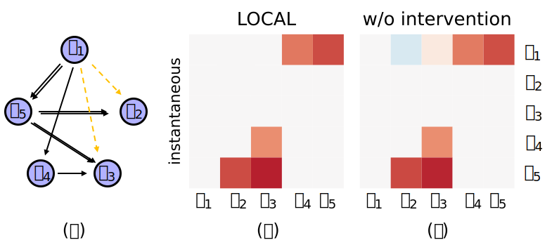

<h2 align="center">LOCAL: Learning with Orientation Matrix to Infer Causal Structure from Interventional Time Series Data</h2>

  <a href="https://faculty.bjtu.edu.cn/rjxy/7930.html"><strong>Weiwei xing</strong></a>
  .
  <a href="https://cyue0316.github.io/"><strong>Yue Cheng</strong></a>
  ·  
  <a href="https://george7317.github.io/"><strong>Jiajun Zhang</strong></a>
   
  

 

## 💬 LOCAL Pipeline 🗨️

- [ ] Source code will be released shortly. (Please check our [project page](https://github.com/George7317/LOCAL) :)
 

## ✍️ Paper summary
Discovering the underlying directed acyclic graph (DAG) in time series observations is very challenging, mainly due to the dynamic nature of the data and the complex nonlinear interactions between variables. Recent research in the field of causal structure learning has focused on using factorization learning methods, such as low-rank matrix factorization, to optimize and reveal causal relationships. At the same time, there is also research dedicated to developing unconstrained methods to improve flexibility and scalability in high-dimensional data environments.

LOCAL is a highly efficient, easy-to-implement, and constraint-free method for recovering dynamic causal structures. LOCAL features two key components: Asymptotic Causal Mask Learning (ACML) and Dynamic Graph Parameter Learning (DGPL). ACML generates causal masks using learnable priority vectors and the Gumbel-Sigmoid function, ensuring the creation of DAGs while optimizing computational efficiency. DGPL transforms causal learning into decomposed matrix products, capturing the dynamic causal structure of high-dimensional data and enhancing interpretability. Furthermore, we introduce the interventional data to facilitate dynamic causal structure learning from perfect interventions.

